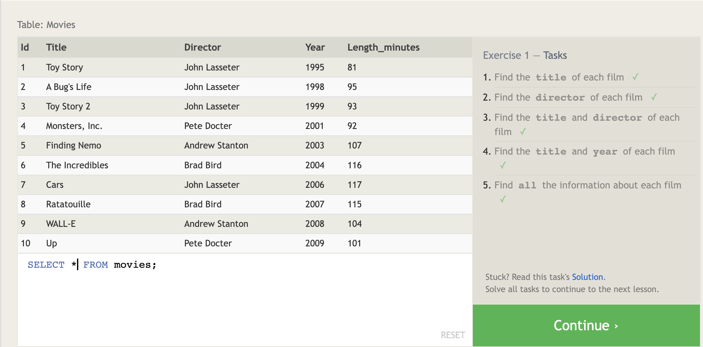
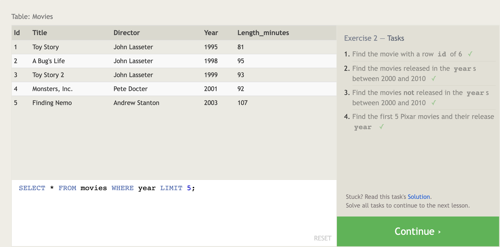
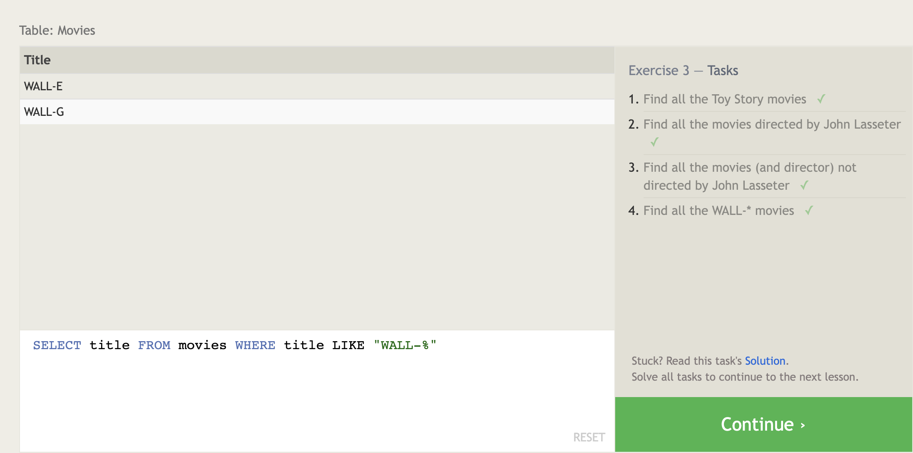
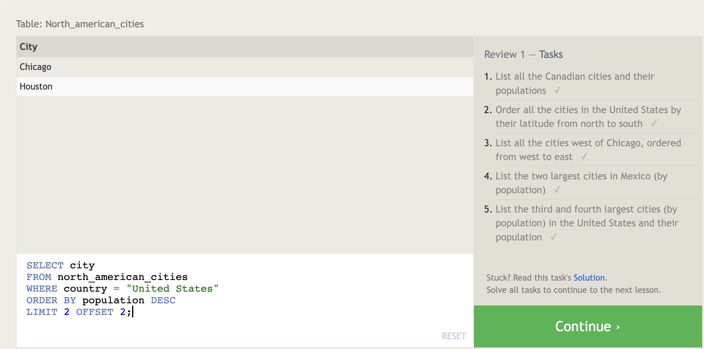
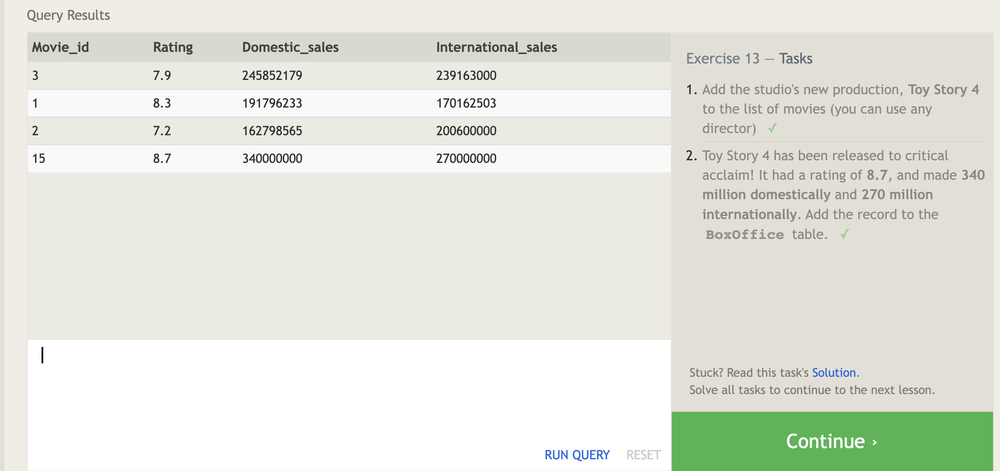
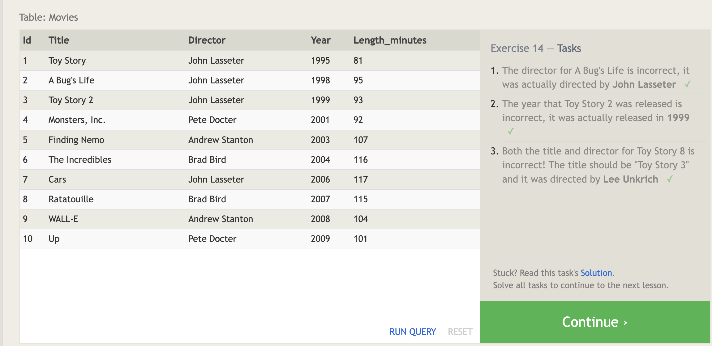
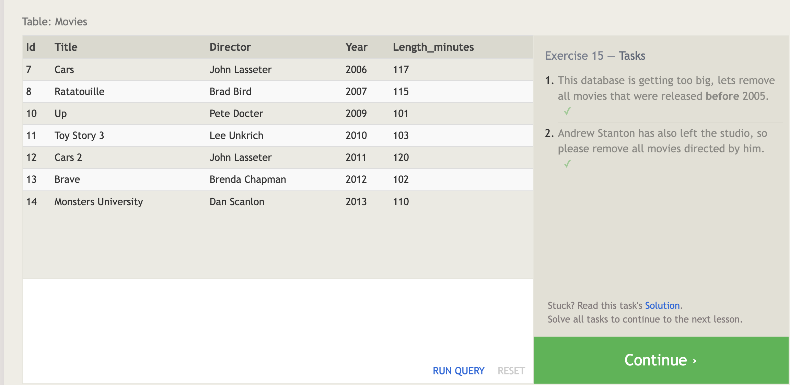
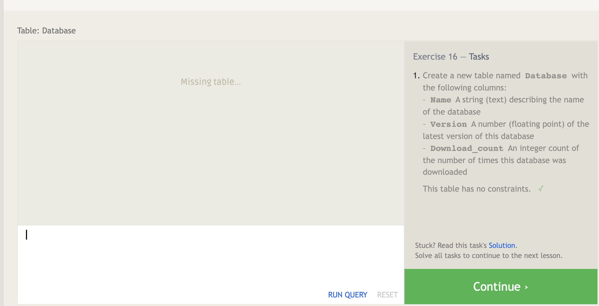
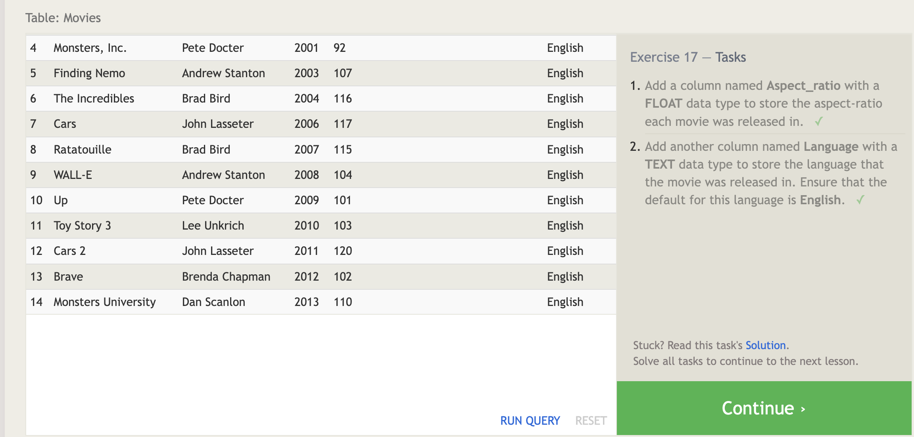
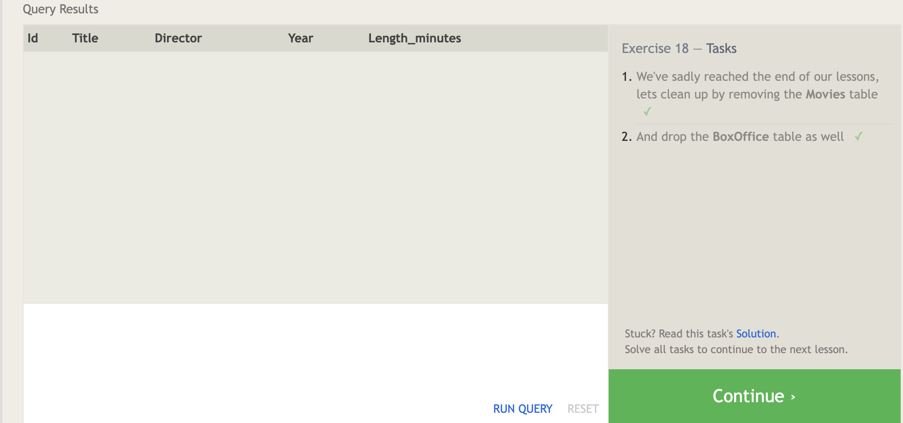

# Prep: Introduction to SQL

## Read SQL Database Tutorial for Beginners, which is an excellent introduction to SQL and relational databases

This SQL tutorial introduces Structured Query Language (SQL), the most widely used database programming language globally. SQL is essential for managing databases, allowing users to query, analyze, create tables, views, indexes, and schemas. The tutorial covers basic SQL commands such as INSERT, SELECT, DELETE, and UPDATE, data types, operators, and table creation. It emphasizes SQL's importance in database management and its industry-standard status. Learning SQL is valuable for anyone working with databases like MySQL, Oracle, or SQL Server, as it's the language of the database and simplifies communication among users.

## Practice running common SQL commands using the following SQL Bolt tutorials

Lessons 1 through 6 - SQL Queries

Lessons 13 through 18 - Database Management

